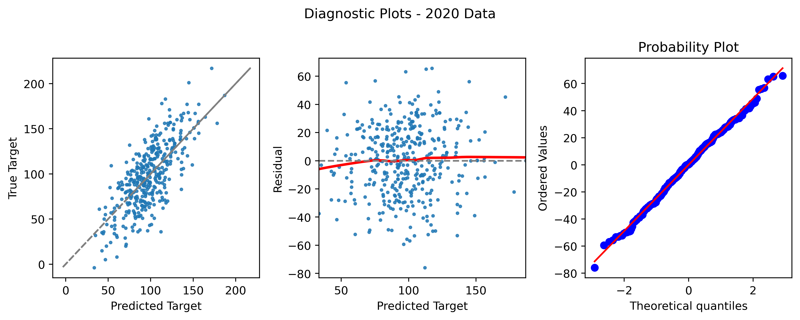

# Metis_Module2_Regression_Project
## Descripton

This is the second project of Metis Data Science Bootcamp. We're going to scrape data from a website and build linear regression models to make useful prediction. I chose to build a linear regression model to interpret/predict the factors of the performances (OPS+, The On-base Plus Slugging Plus) of the batters in MLB.

***

[Project Proposal](project_proposal.md)

***

[MVP](mvp.md)

***
[Presentation Slides](final_presentation.pdf)

[Project Writeup](project_writeup.md)

[Codes](codes/)

***

[Charts](images/)

[Data](data/)

***

  
Bonus

  
#### 2020 Season  
389 players >= 60 plate apperances  
Adjust R-squared: 0.532
MAE: 19.555

