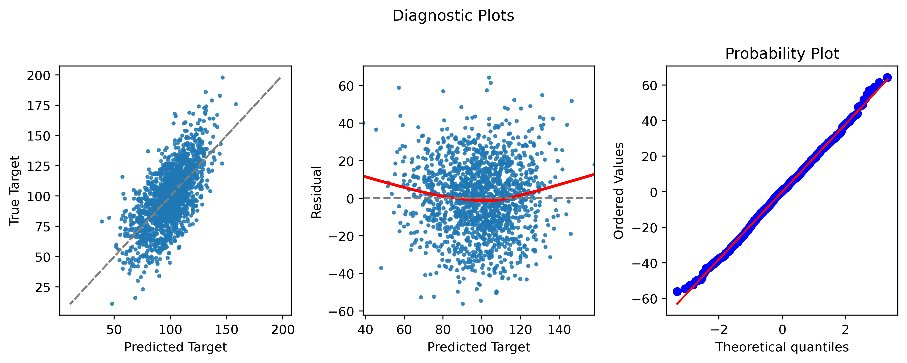

## Analysis of the MLB Batters
###### Chien Yuan Chang

The goal of this project is to better understand which factors are most important in affecting the performances of the batters in the MLB, and how those factors relate to their On-base Plus Slugging Plus (OPS+).

To start exploring this goal, I did the web scraping to get player data from the [Baseball Reference]('https://www.baseball-reference.com/') and also downloaded the statcast data on the [Baseball Savant]('https://baseballsavant.mlb.com/'). I used a linear regression model with 16 features to build the baseline model. R-squared was 0.441 and Adj. R-squared was 0.435. Below are the features and their coefficients and p-values

Features|Coefficient|P-Value
:---|:---|:---|
Age|-0.9678|<0.001*
Debut Season|5.1554|0.026*
Average OPS+ in previous 3 years |0.0571|<0.001*
Average PA in previous 3 years|0.0152|<0.001*
PA in previous year|0.0005|0.263
Pitches per PA|10.8855|0.001*
Hard Hit%|1.5415|<0.001*
Average Launch Angle|-0.2104|0.356
Line Drive%|1.4950|<0.001*
GB/FB|-3.8673|0.001*
Pull%|0.3385|0.005*
Oppo%|0.0299|0.863
Z-Swing%|0.5681|<0.001*
Z-Contact%|1.2015|<0.001*
O-Swing%|-0.3143|0.006*
Sprint Speed|2.1410|<0.001*

The left plot and middle plot above depict the predicted values plotted against the actual values and residuals and show there are positive correlation  but higher residuals when the target is low or high. The Probability Plot above showed the distribution of targets was normal distribution.

I will continue with feature selections and feature engineering to reduce the features, identify the most important features, and optimize the model and then process the cross validation and model selection. 
